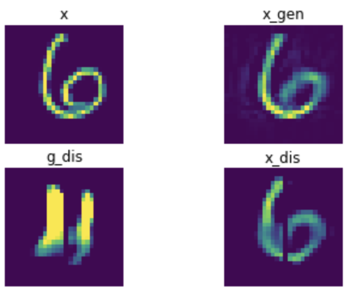

[keras] Anomaly Detection with Adversarial Dual LSTM Autoencoders
===
Tensorflow implementation is provided as the following link.  
https://github.com/YeongHyeon/ADAE-TF
## Architecture
### Objective functions  
L1 -> L2(for more sharpness)
- Discriminator loss function  
  
- Generator loss function  
  

### ADAE architecture
Autoencoder -> LSTM Autoencoder
- Base model  
  
- LSTM Autoencoder  

## Problem Definition
abnormal : [0]  
normal : [1, 2, 3, 4, 5, 6, 7, 8, 9]  

## Result
AUC score : 0.933916  
- Normal samples  

- Abnormal sample  
  

- Error sample  
  

## Environment
- Python : 3.7.10  
- Tensorflow ; 2.4.1  
- keras : 2.4.3  
- Numpy : 1.19.5  

## Reference
[1] Ha Son Vu et al. (2019). <a href="https://arxiv.org/abs/1902.06924">Anomaly Detection with Adversarial Dual Autoencoders</a>. arXiv preprint arXiv:1902.06924.  
[2] Terrance DeVries, Graham W. Taylor. (2017). <a href="https://arxiv.org/abs/1702.05538">Dataset Augmentation in Feature Space</a>. arXiv preprint arXiv:1702.05538.  
[3] Nitish Srivastava et al. (2015). <a href="https://arxiv.org/abs/1502.04681">Unsupervised Learning of Video Representations using LSTMs</a>. arXiv preprint arXiv:1702.05538.  